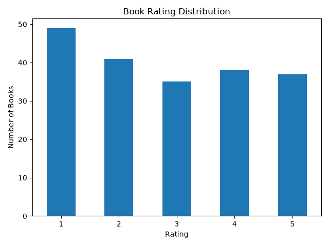
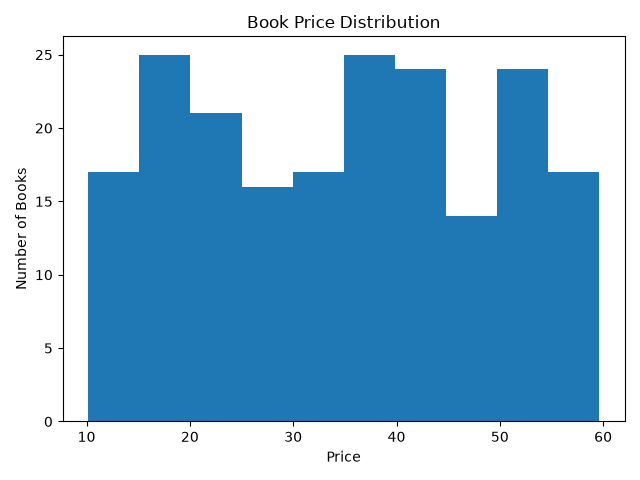
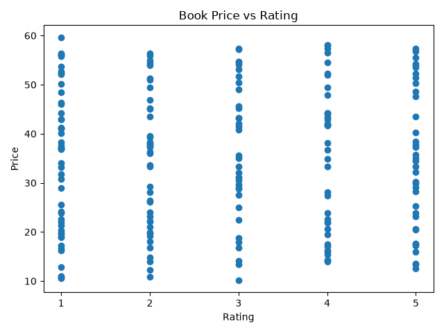

# CodeAlpha Task 2 - Exploratory Data Analysis

## Project Title

**Exploratory Data Analysis of Books Dataset Using Python**

## Objective

The objective of this project is to perform Exploratory Data Analysis (EDA) on a books dataset collected from the Books to Scrape website.

The analysis focuses on understanding book prices, ratings, data quality, and the relationship between price and rating.

## Dataset

The dataset contains information about 200 books collected from the Books to Scrape website.

## Dataset Columns

| Column | Description |
|---|---|
| Title | Name of the book |
| Price | Price of the book |
| Rating | Book rating from 1 to 5 |
| Availability | Availability status |
| URL | URL of the book |

## Technologies Used

- Python
- Pandas
- Matplotlib
- Visual Studio Code

## Exploratory Data Analysis

The following analysis was performed:

1. Examined the first five rows of the dataset.
2. Checked the dataset shape.
3. Examined column names and data types.
4. Generated statistical summaries.
5. Calculated the average book price.
6. Identified the cheapest and most expensive book prices.
7. Calculated the average book rating.
8. Counted the number of books for each rating.
9. Checked for missing values.
10. Checked for duplicate rows.
11. Checked for duplicate book titles.
12. Calculated the price and rating ranges.
13. Calculated the correlation between price and rating.
14. Created visualizations to identify patterns and trends.

## Results

### Dataset Summary

- Total books: **200**
- Total columns: **5**
- Missing values: **0**
- Duplicate rows: **0**
- Duplicate book titles: **0**

### Price Analysis

- Average book price: **34.79625**
- Cheapest book price: **10.16**
- Most expensive book price: **59.64**
- Price range: **10.16 to 59.64**

### Rating Analysis

- Average book rating: **2.865**
- Rating range: **1 to 5**

### Books by Rating

| Rating | Number of Books |
|---:|---:|
| 1 | 49 |
| 2 | 41 |
| 3 | 35 |
| 4 | 38 |
| 5 | 37 |

The 1-star rating is the most common rating, with 49 books.

## Price and Rating Relationship

The correlation between book price and rating is:

**0.0171**

This indicates that there is almost no relationship between book price and rating in this dataset.

## Visualizations

### 1. Book Rating Distribution

The rating distribution chart shows the number of books for each rating from 1 to 5.



### 2. Book Price Distribution

The price distribution histogram shows how the prices of the 200 books are distributed.



### 3. Book Price vs Rating

The scatter plot shows the relationship between book price and rating.



## Key Findings

- The dataset contains **200 books**.
- There are **no missing values**.
- There are **no duplicate rows or duplicate book titles**.
- Book prices range from **10.16 to 59.64**.
- The average book price is approximately **34.80**.
- The average rating is approximately **2.87 out of 5**.
- The 1-star rating is the most common rating.
- The correlation between price and rating is approximately **0.0171**, showing almost no relationship between the two variables.

## Project Files

```text
CodeAlpha_EDA/
│
├── books_dataset.csv
├── eda_analysis.py
├── price_distribution.png
├── rating_distribution.png
├── price_vs_rating.png
└── README.md

## Conclusion

The exploratory data analysis provides an overview of the structure, quality, price distribution, rating distribution, and relationship between price and rating in the books dataset.

The analysis found that the dataset is clean, with no missing values or duplicate records. The results also show that book price and rating have almost no relationship in this dataset.

## Internship Task

CodeAlpha Data Analytics Internship - Task 2: Exploratory Data Analysis